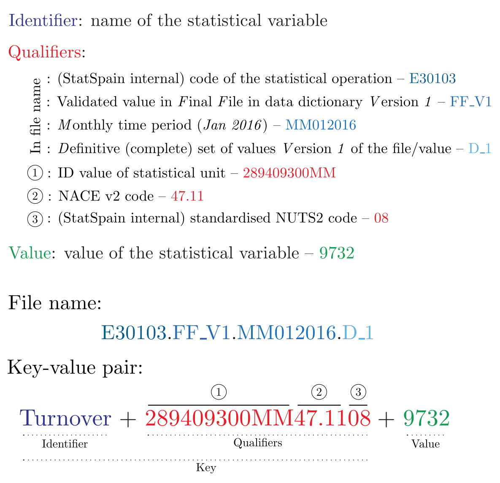

# Introduction
This package implements a set of business logic classes for data processing in some subprocesses of the statistical production process in a statistical office [@GSBPM13a]. The ultimate goal is to define standardised classes valid for all kind of surveys and statistical operations so that further data processing computer procedures in R can be developed against this standard data model for all statistical operations in the office.

To do this, we choose a key-value pair as the standardised abstract data model, which is valid for any kind of statistical operation. In this way every single datum in each statistical operation is univocally identified by the key. The key is compound out of the structural statistical metadata of the concrete statistical operation under representation.

The package basically provides the definition of the classes together with their basic associated methods, namely getters, setters, subsetting and more specific functionalities like data reshaping back and forth into a traditional rectangular data matrix format and combination of objects.

# The statistical data model
As pointed out above, the basic statistical model is a key-value pair data model in which the key is compound and constructed using the structural metadata of the statistical operation at stake. The essential structure of keys is to define an identifier for the statistical variable (we call this *IDDD* for short) plus as many qualifiers as necessary to univocally identify each value.

Let us consider a very simple example. If we are to assign a key to the final validated value *9732* corresponding to the turnover for the Spanish region of Castilla-La Mancha (internal code *08*) associated to the economical activity in retail trade of food and beverages (NACE Rev. 2 code *47.11*) of the business establishment with internal ID code *289409300MM* for the reference time period of January, 2016 in the Spanish Retail Trade Survey (internal code *E30103*), we need the set of qualifiers depicted in the following figure:

{ width=400px }

As the reader can easily see, the IDDD for this value is *Turnover*. Now we need to define the set of qualifiers to univocally identify the value *9732*. Firstly, we take into account (i) the statistical operation in which this datum is contained (Retail Trade Survey, with internal code *E30103*), (ii) the final validated character of the value, in contraposition to raw or intermediately edited values (we design this by *FF* for *F*inal *F*ile, together with the version of the data dictionary containing the definitions of all qualifiers for this survey), (iii) the reference time period (with a specific internal notation *MM012016* -- see package RepoTime), and (iv) the definitive character of the data set containing this value (in contraposition to partial or provisional data sets). Since all data are to be physically stored as plain files by these characteristics, this set of qualifiers will be specified in the name of the file containing this datum.

Secondly, to further pinpoint the value, we also define as qualifiers (i) the ID code of the statistical unit, (ii) the economical activity according to the NACE Rev. 2 standard classification, and (iii) the code for this geographical region. This set of qualifiers is stored and specified side to side with the value (see figure above).

# Classes: definitions, initializers and constructors

## General view

## Class **VarNameCorresp**

## Class **DD**

## Class **StQ**

## Class **rawStQ**

## Class **StQList**

## Class **rawStQList**

# Getters and setters

## Getters

## Setters

# Subsetting

# Specific functionalities

## Managing variable names

## Managing file formats: dcasting and melting

## Combining objects

# References
